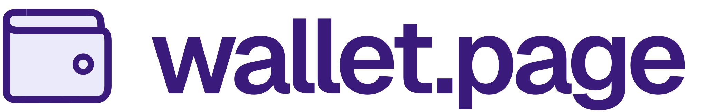

  <a href="https://wallet.page">
    <picture>
      <source srcset="./public/logo_dark.svg" media="(prefers-color-scheme: dark)">
      
    </picture>
  </a>

    Everything you need to know to build an ethereum wallet.

> [!IMPORTANT]
> this page is still under construction.

## Usage

Interactive documentation site for [wallet.page](https://wallet.page), built with [Vocs](https://vocs.dev) **2.0.4**. Each page explains a wallet feature or EIP and includes a live demo to test your browser extension.

Inspired by the [MetaMask test dapp](https://metamask.github.io/test-dapp/).
